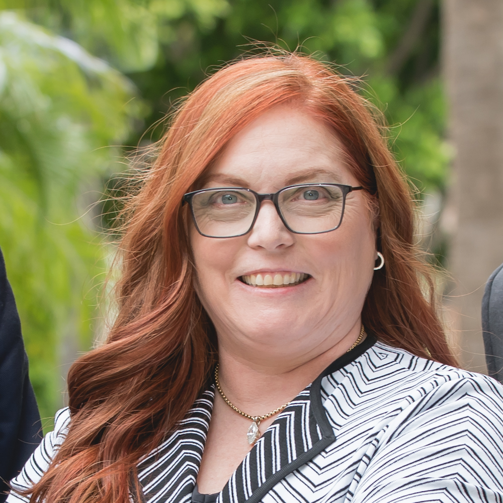

{width=30%}

I’m an anesthesiologist and critical care specialist. I am a partner in Vituity (formerly CEP America), and practice primarily at O’Connor Hospital, part of the Santa Clara Valley Healthcare (SCVH) system. This means that I can put you to sleep and wake you up, and keep you alive in between. Like many of us, I have a rather eclectic group of interests, some of which are indicated on the menu tabs.

I am currently an active member of the American Society of Anesthesiologists and have achieved Fellowship in the society (FASA). I am a Past President and the current ASA Director of the California Society of Anesthesiologists, and am very involved in the educational and advocacy activities of the CSA. One of our biggest goals is to educate people about what anesthesiologists actually do, and why you need one if you’re having surgery. I have been a Director and Webmaster for the Society of Critical Care Anesthesiologists. I also am or have been on several ASA committees, including the Electronic Media and Information Technology (EMIT) Committee (which I chaired for 6 years)(now called CIIT), the Annual Meeting Subtrack Committee on Critical Care (which I currently Chair), the Committee on Bylaws (which I currently Vice-Chair), the Critical Care Committee, and the Trauma and Emergency Preparedness Committee. I am also involved in Medical Staff Leadership at O’Connor Hospital.

After years of dealing with computers and software at the hospital, I decided to go back to school and get my masters in Biomedical Informatics. Oregon Health & Science University is one of the premiere sites to study this topic, and the DMICE program is aimed at practicing clinicians. I’m learning new things, but also learning how to use the “correct lingo” to communicate clinical issues to tech staff and vice versa. 

Outside of the medical field, my husband and I participate with several non-profit organizations in the science fiction community, helping to produce events including Worldcon, the annual convention sponsored by the World Science Fiction Society. My roles have predominantly been in the Program Division, including internal video teams (live broadcast and taped productions), podcasting, program development, and speaker development. I was the Program Division Director for Westercon66 (2013) and Worldcon76 in San Jose (2018).

I have also participated in Masquerades as a contestant, the Emcee’s assistant/prompter, Judge’s clerk, video crew, and Judge. I was the Co-Director of the Masquerade for Worldcon75 in Helsinki, the Stage Manager for the Masquerade at Dublin 2019: An Irish Worldcon, and was the Co-Chair of Costume-Con 39, held in San Jose in 2023.

visit my primary site at:  [Christine Doyle](https://www.monty-doyle.com)
